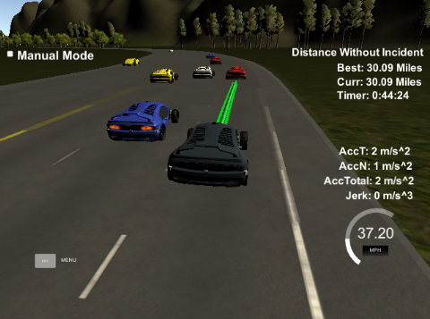

# Path Planning
> Behaviour planning, trajectory generation, sensor fusion, finite state machine

## INTRODUCTION
The goal of this project is to navigate an ego-car around a virtual highway by designing a path planner that creates a trajectory for the car to follow using localisation, sensor fusion and map data. The car must stick within the 50 MPH speed limit, while navigating quickly, safely and smoothly. There is other traffic on the road, meaning the car will have to change lanes to find the quickest route along the highway. As well as being safe (no hitting the other cars!), the car must navigate smoothly - not experiencing a total acceleration over 10 m/s^2 or jerk over 10 m/s^3.

This project was undertaken as part of the [Udacity Self-Driving Car NanoDegree](https://eu.udacity.com/course/self-driving-car-engineer-nanodegree--nd013).

## RELEVANT LINKS
#### Original project repo
* https://github.com/udacity/CarND-Path-Planning-Project

## RELEVANT FILES
#### Project writeup
* [writeup.md](writeup.md)

#### Code
* [main.cpp](src/main.cpp)
* [spline.h](src/spline.h)
