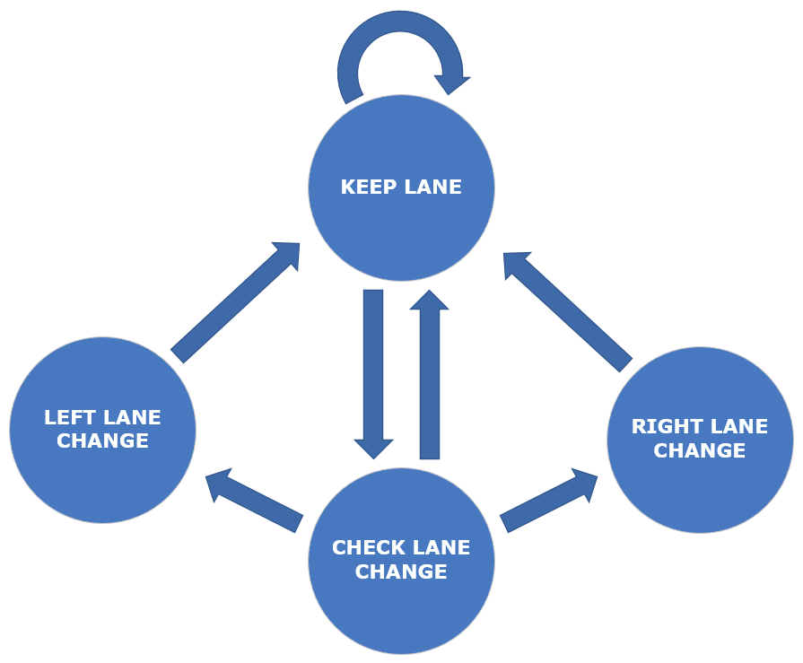

# Path Planning Project
A path planner creates smooth, safe trajectories for the ego-car to follow based on a map of the virtual highway plus localisation data and sensor fusion. The main aims are to avoid collisions and make decisions about which lane to be in to pass traffic.

||
|:-:|
|Fig1: A snapshot of the simulator, having driven over 30 miles|

The following writeup provides a description of the main components of the code that contribute towards navigating the ego-car around the virtual highway, shown in figure 1. To help differentiate between which vehicle is being talked about, the one being controlled by the code will be referred to as the ego-car, whereas highway traffic will be referred to as traffic, cars or car.

---
## Overview
The ego-car transmits its location, along with data from sensor fusion, which estimates the location of all the cars on the same side of the road. In `main.cpp`, this data is received via events. A static map of the highway is also available, providing fixed waypoints that follow the virtual highway.

The main components of the code can be described as follows:
* A __Finite State Machine__ to plan for and carry out the behaviour of the ego-car
* __Sensor fusion__ data processing to look at the state of traffic
* __Waypoint generation__ to given the ego-car a trajectory to follow

## Finite State Machine
Highway driving can be thought of as being more structured than other forms of driving, such as urban driving or parking. As such, a Finite State Machine (FSM) can provide a suitable mechanism of flow control to move between a set of defined behavioural states.

Figure 2 is the FSM developed for use in this project.

||
|:-:|
|Fig2: The Finite State Machine used to implement behaviour based on sensor fusion data|

#### Keep Lane state
The initial state is the `KEEP_LANE` state and is the common state for highway driving. The `too_close` flag is used to identify if the ego-car has got too close to a car positioned in the same lane in front of it. If the flag is not set then the ego-car is made to travel just within the speed limit.

```cpp
if (!too_close)
  target_vel = 49.5;
if (check_turn)
  next_state = CHECK_LANE_CHANGE;
else
  next_state = KEEP_LANE;
```

The `check_turn` flag is used to indicate whether or not a lane change should be attempted. This flag is set when a slower moving car is identified as being in the same lane, so that the ego-car can try to manoeuvre into a neighbouring lane to overtake it.

#### Check Lane Change state
The `CHECK_LANE_CHANGE` state checks two flags, `can_turn_left` and `can_turn_right`, to see if a lane change is allowed. The flags are set by processing the sensor fusion data to determine whether or not is is safe to change lanes given the positions of the cars. The flags are also set if the ego-car would move outside the 3 lane highway if it performed a lane change.

```cpp
if (can_turn_left)
  next_state = LEFT_LANE_CHANGE;
else if (can_turn_right)
  next_state = RIGHT_LANE_CHANGE;
else
  next_state = KEEP_LANE;
```

In this encoding, a left lane change is given priority over a right lane change. If neither flag is set the ego-car re-enters the `KEEP_LANE` state and no lane change occurs.

#### Left/Right Lane Change states
If while in the `CHECK_LANE_CHANGE` state either of the lanes were safe to move in to, the ego-car enters the appropriate state: `LEFT_LANE_CHANGE` or `RIGHT_LANE_CHANGE`. As indicated earlier, if both lanes are safe to move in to, the ego-car will choose the left lane.

```cpp
lane -= 1;
next_state = KEEP_LANE;
```

A lane change is performed by updating the `lane` variable. The ego-car is then made to return to the `KEEP_LANE` state.

## Sensor Fusion
The sensor fusion data provides a list of all the cars on the right-hand side of the road. Each car is described in terms of its metadata, as show in the following table:

|Car Metadata|Description|
|:-:|:-:|
|id|Unique identifier|
|x, y|x and y positions in map coordinates|
|vx, vy|x and y velocities in meters per second|
|s|Longitudinal position in Frenet coordinates|
|d|Latitudinal position in Frenet coordinates|

Processing the sensor fusion data consists of first looping through every car and identifying which lane it is in to determine what to infer from the car's location.

```cpp
for (int i = 0; i < sensor_fusion.size(); ++i) {
  if (d < (2+4*lane+2) && d > (2+4*lane-2)) ;
  ...
  else if (d < (2+4*(lane-1)+2) && d > (2+4*(lane-1)-2))
  ...
  else if (d < (2+4*(lane+1)+2) && d > (2+4*(lane+1)-2))
  ...
}
```

The `lane` variable holds the current lane value of the ego-car; 0, 1 or 2 from left to right. The if-else blocks are checking if the car is in the same lane as the ego-car, or in a lane one to the left or one to the right of the ego-car.

##### Same lane
If the car is in the same lane as the ego-car, some further checking is made to determine how to respond. First, all cars behind the ego-car are filtered out. Then, any car that is within a certain distance in front of the ego-car causes a corresponding reaction. The variable `safe_dist_front` is set to 30 meters. Therefore, once a car is registered within 30 meters the `check_turn` flag is set to instruct the ego-car to attempt a lane change.

```cpp
if (check_car_s < (car_s + safe_dist_front-20)) {
  too_close = true;
  target_vel = 0;
...
} else if (check_car_s < (car_s + safe_dist_front-5)) {
  too_close = true;
  target_vel = 30;
} else if (check_car_s < (car_s + safe_dist_front)) {
  check_turn = true;
}
```

If the lane change is unsuccessful, the ego-car will get nearer to the car, until at 25 meters the `too_close` flag will get set and a drop in speed will also get set. Some further drops in speed are instructed until eventually, when the car is within 10 meters of the ego-car, the speed is dropped to 0 MPH. This covers the eventuality that the car in front has dramatically reduced speed due to traffic. In a highway situation this is expected to be a less common scenario, but helps to protect the ego-car from causing a collision.

##### Left/right lane
If the car is in the lane to the immediate left or right of the ego-car its position is checked to determine if it would be safe to change lanes. The code example below checks whether a car in the left lane is within a certain range both in front of and behind the ego-car. The variable `safe_dist_front` is set to 10 meters.

```cpp
if ((check_car_s > (car_s - safe_dist_back)) &&
    (check_car_s < (car_s + safe_dist_front))) {
  can_turn_left = false;
}
```

## Waypoint Generation
Now that a decision has been made about how the ego-car should manoeuvre, a trajectory must be formed for the ego-car to follow.

[1]:https://en.wikipedia.org/wiki/Spline_(mathematics)
[2]:http://kluge.in-chemnitz.de/opensource/spline/

The trajectory is made using a [spline][1], with help from the Cubic Spline interpolation [header file][2].

The first step is to construct a set of x and y coordinates that will project out in front of the ego-car. Each successive xy coordinate represents a point in space that the ego-car will be located 0.02 seconds from the previous xy point. The greater the distance between two points, the faster the ego-car must travel, and so this is used to control the ego-car's forward velocity.

Each cycle, the first xy coordinates are taken from looking at the previous cycle's remaining points. This ensures that there is a smooth transition from cycle to cycle with no discontinuities, which will cause jerk. Then, 3 waypoints are calculated 30, 60 and 90 meters in front of the car in the lane number defined by the `lane` variable set earlier in the code.

The xy points are converted from map coordinates to local coordinates, where the forward facing direction of the ego-car is along the x-axis, and the y-axis extends perpendicular to the left of the ego-car. These points are then passed to a newly created spline object.

Finally, the x and y values that will be sent back to the simulator can be constructed, `next_x_vals` and `next_y_vals`. They are first populated with any remaining xy values that were not consumed by the simulator in the previous cycle.

```cpp
for (int i = 0; i < previous_path_x.size(); ++i) {
  next_x_vals.push_back(previous_path_x[i]);
  next_y_vals.push_back(previous_path_y[i]);
}
```

To generate a total of 50 points (corresponding to 50*0.02 = 1 second of simulator time) the `next_x_vals` and `next_y_vals` vectors are filled up with points provided by the spline object using a target point on the horizon. Below, a target of 30 meters in the x-axis (in local coordinates) is given, and the corresponding y is provided by the spline object. The corresponding y point will either be 0, indicating the same lane or +/- some value, indicating a lane change. This xy coordinate is used to calculate the straight line distance, `target_dist`, from the ego-car to this point.

```cpp
double target_x = 30;
double target_y = s(target_x);
double target_dist = sqrt(pow(target_x, 2) + pow(target_y, 2));

for (int i = 1; i <= 50-previous_path_x.size(); ++i)
  ...
```

This target distance will be divided up into as many segments as their are remaining points (50 minus the number of previous points). Each segment will be `N` meters long, depending on the reference velocity, `ref_vel`. For a constant velocity, `N` will remain constant. Otherwise, `N` will change according to the velocity the ego-car is travelling.

```cpp
if (ref_vel < target_vel)
  ref_vel += .2;
else if (ref_vel > target_vel)
  ref_vel -= .2;

double N = target_dist / (.02 * ref_vel/2.24);
```

The x and y points are iteratively calculated using `N` and the spline object. Each point is also transformed back into map coordinates. Once 50 points are generated, they are sent to the simulator.


## Future work
#### Cost functions
Currently, the FSM ignorantly prioritises moving into the left lane to overtake traffic, even if the left lane may contain a slower moving car up ahead. This is because there are no optimisations to improve the decision making.

To improve this model, cost functions could be implemented that score different projections of how the ego-car could behave. By weighting the cost functions appropriately, an optimised decision about what manoeuvre to take would help the ego-car navigate more efficiently through the traffic.
